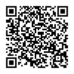

# 出门问问古诗今译开源数据集

出门问问序列猴子古诗今译开源数据集（以下简称序列猴子数据集）是用于将古诗翻译为现代文的数据集。本次开放的诗词数量，共计逾680,000首。

## 数据格式简介

序列猴子数据集以诗人所属的朝代不同而划分为不同的文件夹。在同一文件夹下，不同诗人的作品存储在各自独立的 `JSON` 类型文件中。`JSON` 文件则以诗人的名字来命名（如：`李白.json`）。

`JSON` 文件格式如下：

  ```json
  [
    {
        "title": "<诗作名称>",
        "type": "<诗作类型>",
        "paragraph": [
            "<诗作原文>"
        ],
        "translate": [
            "<诗作译文>"
        ]
    },
    ...
  ]
  ```

## 数据下载

### 下载地址

序列猴子数据集的下载链接如下：
  - http://share.mobvoi.com:5000/sharing/WNpEqItCg

也可通过扫描如下二维码来得到下载链接：<br>
  

### 完整性校验

序列猴子数据集的 `MD5` 摘要信息如下。在下载完成后，可通过使用对比该摘要信息来验证下载数据的完整性。
  - `42ca0782bdc0165b8e5a68186d04aa8c`

比如在Linux系统上，可使用如下命令来计算下载后数据的 `MD5` 摘要信息：

  ```shell
  md5sum <下载后保存的文件>
  ```

### 数据解压

为降低传输和存储带宽要求，序列猴子数据集以 `*.tar.bz2` 格式的压缩包形式来提供。请在下载完成之后进行解压，以得到最终的开源数据。

比如在Linux系统上，可使用如下命令来进行解压：

  ```shell
  tar xvfj <压缩包文件>
  ```
